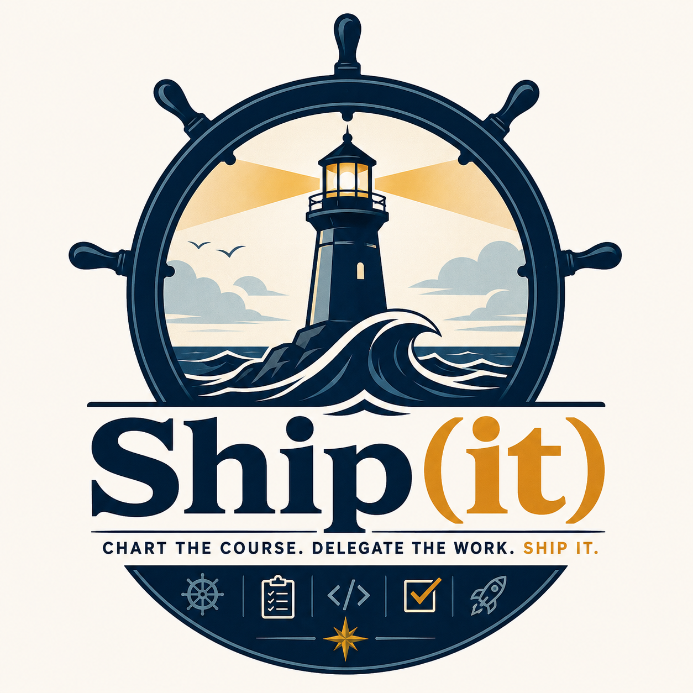

# Ship(it)

<p align="center">
  
</p>

<p align="center">
<b>Chart the Course. Delegate the Work. Ship It.</b>
</p>

---

## What is Ship(it)?

Ship(it) is an opinionated agentic software engineering control plane.

It exists because modern frontier models are remarkably capable, but most agent frameworks still require constant supervision, endless prompt tweaking, and repeated human intervention.

Ship(it) treats software delivery as a system.

You provide:

* The destination
* The constraints
* The engineering preferences
* The acceptable risk

Ship(it) handles:

* Planning
* Research
* Delegation
* Implementation
* Testing
* Adversarial review
* Documentation
* Reporting

The human remains the Captain. Delegate authority if you like, but the responsibility remains yours.

The agents are the Crew. Some are near equals of the Captain, some are specialists, but all work together to achieve the captain's intent.

---

## Why?

Because most agent systems optimize for conversations.

Engineering teams optimize for artifacts.

At the end of the day nobody ships a chat transcript.

They ship:

* Specifications
* Pull Requests
* Infrastructure
* Tests
* Documentation
* Deployments

Ship(it) is designed around producing those artifacts while maintaining traceability, reviewability, and human control.

---

## Core Philosophy

### The Captain Sets Direction

Humans define goals.

Agents determine execution details.

---

### Artifacts Over Chats

The primary output is not conversation.

The primary outputs are:

* Specs
* Code
* Tests
* Reports
* Documentation

---

### Trust, But Verify

Every significant artifact should be independently reviewed.

Every implementation should be tested.

Every decision should be traceable.

---

### Cheap Models Do Cheap Work

Not every task requires a frontier model.

Ship(it) continuously evaluates:

* Cost
* Quality
* Latency
* Success rate

to determine which model should perform which work.

---

### Learning Is A Feature

Most agent frameworks repeat the same mistakes forever.

Ship(it) treats execution history as data.

If:

* GPT-5 Mini consistently succeeds at ticket classification
* Gemini Flash consistently excels at large-document summarization
* Claude Code consistently outperforms alternatives for repository implementation
* Opus consistently identifies architectural flaws missed elsewhere

Ship(it) should learn from that evidence.

Future runs should improve.

---

## Example

Input:

```text
Build a control console for ISO 8583 authorization rules.
```

Ship(it) produces:

```text
/specs/control-console.md

/plans/implementation-plan.md

/docs/architecture.md

/internal/reviews/adversarial-review.md

/tests/e2e/control-console.spec.ts

/tests/integration/rules_engine_test.go

/final-report.md
```

without requiring a human to manually orchestrate each step.

---

## Learning Loop

The most important component of Ship(it) is not the planner.

It is the feedback system.

Every task execution records:

* Model
* Prompt
* Cost
* Latency
* Success score
* Review score
* Test results
* Human approval outcome

This creates a continuously growing execution history.

Ship(it) can then answer questions such as:

> "Claude Code solved this class of implementation problem 83% faster than alternatives."

> "Adding architectural constraints improved review pass rates by 27%."

> "Gemini Flash provides equivalent document-analysis quality at one-tenth the cost."

The goal is not merely automation.

The goal is improvement.

---

## Architecture

```text
Captain
    │
    ▼
Orchestrator
    │
    ▼
Task Graph
    │
    ├── Planner
    ├── Researcher
    ├── Implementer
    ├── Tester
    ├── Reviewer
    └── Documentation Writer
    │
    ▼
Artifacts
    │
    ▼
Review
    │
    ▼
Tests
    │
    ▼
Ship It
```

---

## Example Command

```bash
shipit run \
  --goal "Build ISO 8583 control console" \
  --repo ./control-console \
  --profile ted-defaults.yaml
```

---

## Getting Started

Ship(it) currently runs as a local-first Go CLI.

Prerequisites:

* Go 1.26 or newer
* Git
* A target repository with at least one commit, because Ship(it) creates an isolated Git worktree from `HEAD`

Important Git caveat:

Ship(it)'s isolated worktree is created from committed Git state. Untracked files in the source repository are recorded in `run.yaml` as original repo status, but they are not automatically copied into the run workspace. Commit the files you want Ship(it) to inspect, or add an explicit dirty-file import flow before relying on repository analysis.

Run the test suite:

```bash
go test ./...
```

Create a local run:

```bash
go run ./cmd/shipit run \
  --goal "Exercise the Ship(it) loop" \
  --repo . \
  --auto-approve-plan
```

`run` prints the generated plan and the exact next command to execute it.

Create, execute, and print the final report in one serial pass:

```bash
go run ./cmd/shipit run \
  --goal "Exercise the Ship(it) loop" \
  --repo . \
  --full
```

Inspect the run:

```bash
go run ./cmd/shipit status --run <run_id> --repo .
go run ./cmd/shipit tasks --run <run_id> --repo .
go run ./cmd/shipit log --run <run_id> --repo .
```

Execute the task graph serially:

```bash
go run ./cmd/shipit execute \
  --run <run_id> \
  --repo . \
  --max-tasks 10
```

View the final report:

```bash
go run ./cmd/shipit report --run <run_id> --repo .
```

Regenerate the document index:

```bash
go run ./cmd/shipit index --run <run_id> --repo .
```

Run artifacts are written under:

```text
.shipit/runs/<run_id>/
```

Important files include:

* `run.yaml`
* `task-graph.current.yaml`
* `task-status.json`
* `artifacts/tasks/<task_id>/worker-input.yaml`
* `artifacts/tasks/<task_id>/worker-result.yaml`
* `artifacts/tasks/<task_id>/changes.patch`
* `artifacts/tasks/<task_id>/gate-results.yaml`
* `artifacts/reports/final-delivery-report.md`
* `artifacts/document-index.yaml`
* `evals/run-evaluation.yaml`
* `evals/task-evaluations.yaml`
* `logbook/run.jsonl`

Useful run policy knobs:

```bash
go run ./cmd/shipit run \
  --goal "Exercise policy knobs" \
  --repo . \
  --auto-approve-plan \
  --max-parallel-tasks 1 \
  --integration-tests-blocking when_runnable \
  --dirty-state-strategy fix_in_place \
  --failure-loop-captain-review-threshold 2
```

Supported dirty-state strategies:

* `fix_in_place`: repair starts from the rejected workspace state.
* `orchestrator_rollback`: Ship(it) rolls the worktree back before repair.
* `executor_discretion`: persisted as a policy mode for future worker discretion.

Supported integration-test policies:

* `when_runnable`: block only when an integration test path is discovered.
* `always`: require integration tests and reject when none are runnable.
* `never`: skip integration tests.

Current executor behavior is intentionally local and deterministic. The planner and workers are stubs that exercise the control loop, artifact contracts, review gates, repair generation, checkpoint commits, final reports, and evaluations without calling external models.

### OpenAI Planner

The planner can call OpenAI's Responses API to generate the run spec and architecture note while Ship(it) still validates and owns the task graph.

Set an API key:

```bash
export OPENAI_API_KEY="..."
```

Run with the OpenAI planner:

```bash
go run ./cmd/shipit run \
  --goal "Plan the next Ship(it) feature" \
  --repo . \
  --planner openai \
  --planner-model gpt-5-mini
```

If `--planner-model` is omitted, Ship(it) uses `SHIPIT_OPENAI_MODEL` and then falls back to `gpt-5-mini`.

---

## Preference Profiles

Engineering preferences are first-class citizens.

Example:

```yaml
backend:
  prefer:
    - Go

frontend:
  prefer:
    - React
    - HTMX

deployment:
  prefer:
    - Docker Compose

testing:
  require:
    - deterministic_seeds
    - integration_tests
    - e2e_tests

ui_testing:
  prefer:
    - Playwright

documentation:
  style:
    - aggressive
```

The goal is to encode engineering taste once and reuse it forever.

---

## Current Status

```text
[x] Local run skeleton
[x] Planner and task graph generation
[x] Serial task executor
[x] Review, repair, and checkpointing
[x] Final report and evaluation
[x] Hardening knobs
[ ] Model-backed workers
[ ] Model Router
[ ] MCP Gateway
[ ] Learning Engine
[ ] Web UI
```

---

## Non-Goals

Ship(it) is not:

* A chatbot
* An autonomous CEO
* Artificial General Intelligence
* A replacement for engineering judgment

Ship(it) is a force multiplier for experienced engineers. It pushes the human to do the things humans do best - exercise tastes, plan constraints, understand context, understand priorities and importance - and LLMs and computers to do the things that LLMs do best - generate code, check for completeness/correctness, iterate, loop, and action on feedback.

---

## License

TBD

Probably something permissive but non-commercial-ish. Fork my stuff but please don't buy an actual ship with the proceeds.

Unless the agents become self-aware.

Then all bets are off.
